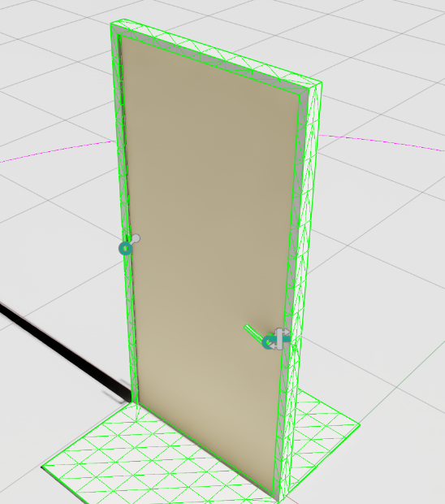

# 🚪 Open_Door

**Open_Door** is an articulated USD asset designed for simulating hinged mechanisms like doors, gates, or latches for training robotic manipulation policies in physics-based environments (e.g., Isaac Sim).


It's not just a door... it's a *Jurassic testbed* for robotic dexterity.

---

## 🧠 Features

- ✅ **Hinged structure** with realistic revolute joints
- 🦾 Includes latch and handle subcomponents
- 🔧 Layered assembly for extensibility (hinges, pins, leaves)
- 📁 Structured in USD for maximum compatibility with Omniverse tools
- 🦖 Fully rigged — ready for your robot to open like a clever Velociraptor™


---

## 📁 Asset Structure

The door is organized hierarchically in USD with nested transform (Xform) nodes:


```

Open\_Door/
├── Assembly\_1/
│   ├── latch/
│   ├── handel/
│   └── Hinge\_Door/
│       ├── HingeLeaf/
│       │   ├── Wood\_Door
│       │   ├── HingePin
│       │   └── HingeLeaf (nested)
│       └── Frame/
│           └── HingeLeaf\_01
└── Revolute\_1 (hinge joint)

```

Each component is scoped and grouped for simulation readiness.

---

## 🧪 Use Case

Ideal for:
- Robotic manipulation policy training
- Perception + affordance learning (door grasping)
- Sim-to-real tests of handle/push/pull interaction

---

## 🚀 Quick Use

1. Clone the repo or download the USD bundle.
2. Load into **Omniverse USD Composer** or **Isaac Sim**.
3. Attach a robot end-effector, apply torque to `Revolute_1`, and start swinging!

---

## 🧱 Integration Notes

- The revolute joint (`Revolute_1`) controls the primary hinge.
- Add physics material or collision shapes as needed.
- Use articulated views for inspection/debugging.

---

## 🧬 License

Open source under [MIT](../LICENSE) — free to study, use, modify, and deploy.

---

## 🦕 Fun Fact

Most dinosaurs didn’t use doors. But if they did, they’d absolutely test your hinge tolerances.

---

**Built for robots. Inspired by raptors.**
